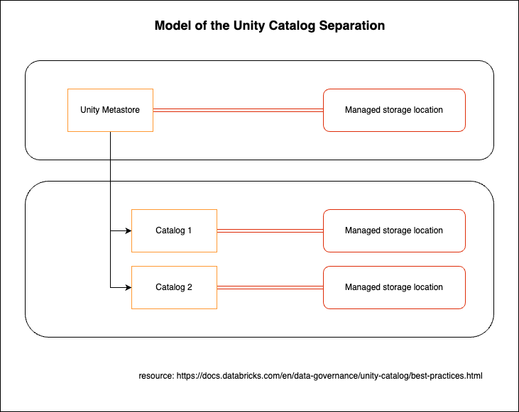
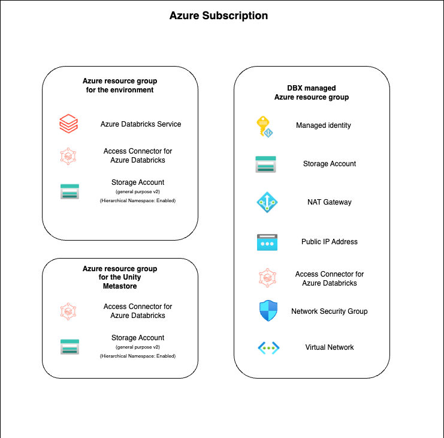
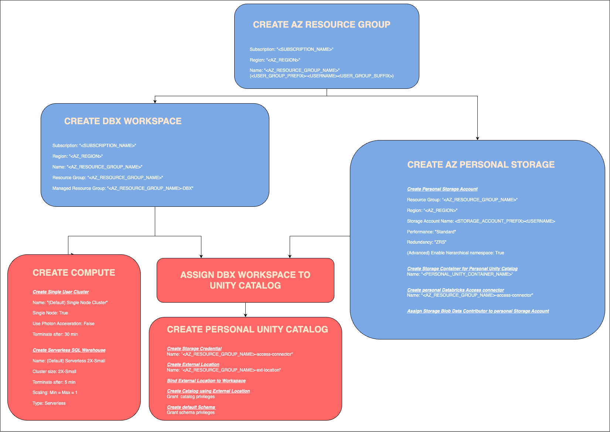

# terraform-provision-azure-databricks-environment
Terraform code to provision a Databricks environment for a user in Azure Databricks.

## Use case:

We have a centralized Unity Catalog for all of our internal Databricks users.
We provide every user with a personal
* Azure Storage Account
* Unity Catalog stored externally on the Personal Azure Storage Account
* Databricks Workspace with default Job Cluster and Serverless Sql Warehouse

## Architecture

### Unity Catalog

### Azure

#### Manual setup procedure of the Azure resources

## Project structure

* ./config/ - environment configurations
* ./doc/ - documentation materials
* ./python_code/ - script that creates and saves 'terraform.tfvars' file and commands to run for provisioning
a specific environment
* ./python_tests/ - unit tests for the python code
* ./terraform_code/ - generic terraform procedure to create an environment
* ./terraform_states/ - configuration and status for every environment in separate directories
(directory naming is based on: Azure subscription and the Azure resource group created for the environment)
* ./.gitignore - patterns git should ignore
* ./LICENSE - Apache 2.0 open source license
* ./README.md - this file

## Prerequisites

* Terraform - [installation instructions](https://developer.hashicorp.com/terraform/tutorials/aws-get-started/install-cli)
* Azure CLI - [installation instructions](https://learn.microsoft.com/en-us/cli/azure/install-azure-cli).
* Databricks CLI - [installation instructions](https://docs.databricks.com/en/dev-tools/cli/install.html)
* Python 3 - optional used for script based configuration - [download](https://www.python.org/downloads/)
* Authenticate for Azure CLI
  > az login
* Authenticate for Databricks CLI ([more info](https://docs.databricks.com/en/dev-tools/cli/authentication.html))
  > databricks configure

## Provisioning an Environment

### Clone repository
> git clone https://github.com/Hiflylabs/terraform-provision-azure-databricks-environment.git

> cd ./terraform-provision-azure-databricks-environment/

### Initialize Terraform

> terraform -chdir="./terraform_code" init

### Create Configuration

There are two was of creating the configurations:

* [Configuration via Python Script](./doc/script_config.md) - this is the recommended way!
* [Manual Configuration](./doc/manual_config.md)

### Run Terraform code

Run the 'apply command from _./terraform_states/{PREFIX}{USERNAME}{SUFFIX}/terraform_commands.txt_.
