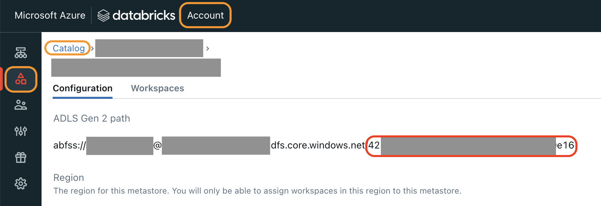

# Locations where ID values can be found

* AZ_SUBSCRIPTION_ID: Select the subscription on the [Azure console](https://azure.microsoft.com/). It's in Overview.

  

* DBX_ACCOUNT_ID: Select the down arrow in the upper right corner, next to your username
in the [Databricks Management Console](https://accounts.azuredatabricks.net/)
  

* DBX_METASTORE_ID: Select the catalog in the Catalog tab of the [Databricks Management Console](https://accounts.azuredatabricks.net/).
The value is at the end of the 'ADLS Gen 2 path'.
  
