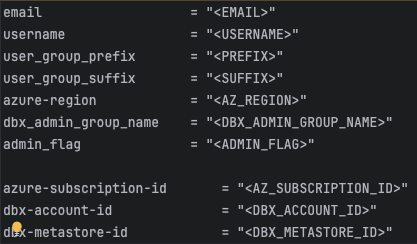

# Manual Configuration

## Create configuration

* Make environment specific directory and copy tfvars.template

  > mkdir -p ./terraform_states/{PREFIX}{USERNAME}{SUFFIX}

  > cp ./terraform_code/terraform.tfvars.template ./terraform_states/{PREFIX}{USERNAME}{SUFFIX}/terraform.tfvars

* Set variables in _./terraform_states/{PREFIX}{USERNAME}{SUFFIX}/terraform.tfvars_

  

  For the places where the required ID's can be found see [getting_environment_ids.md](getting_environment_ids.md).

## Create Terraform Commands

### Create Terraform Apply Command

Replace {AZ_SUBSCRIPTION_ID} and {PREFIX}{USERNAME}{SUFFIX} in command below:

> terraform -chdir="./terraform_code" apply -var-file="../terraform_states/{AZ_SUBSCRIPTION_ID}/{PREFIX}{USERNAME}{SUFFIX}/terraform.tfvars" -state="../terraform_states/{AZ_SUBSCRIPTION_ID}/{PREFIX}{USERNAME}{SUFFIX}/terraform.tfstate"

### Create Terraform Destroy Command

Replace {PREFIX}{USERNAME}{SUFFIX} in command below:

> terraform -chdir="./terraform_code" destroy -var-file="../terraform_states/{AZ_SUBSCRIPTION_ID}/{PREFIX}{USERNAME}{SUFFIX}/terraform.tfvars" -state="../terraform_states/{AZ_SUBSCRIPTION_ID}/{PREFIX}{USERNAME}{SUFFIX}/terraform.tfstate"

## Save Terraform Commands

Enter the above commands into a text editor and save it to _./terraform_states/{AZ_SUBSCRIPTION_ID}/{PREFIX}{USERNAME}{SUFFIX}/terraform_commands.txt_.
