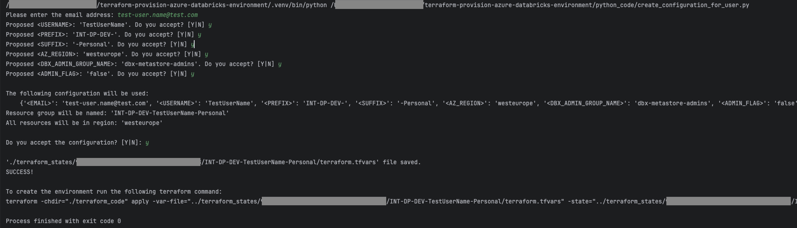
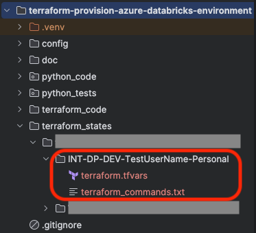

# Configuration via Python Script

A Pyhton script was created in order to:
* facilitate the creation of the configurations
* enforce naming standards
* lower the possibility for human errors.

## Setup

1. Set $PYTHONPATH environment variable
    > export PYTHONPATH=./

## Configure

Note: This configuration needs to be done once.

1. Create admin_config.json based on admin_config.json.template
   > cp ./config/admin_config.json.template ./config/admin_config.json

2. Set values in ./config/admin_config.json

   For the places where the required ID's can be found see [getting_environment_ids.md](getting_environment_ids.md).

3. Optionally change miscellaneous configurations in ./python_code/config.py

## Run the configuration script

>  python3 ./python_code/create_configuration_for_user.py

The script asks for an email address. Based on this email address, it proposes configuration values.
Either accept the proposed values or decline them and provide yours.

The Terrafom apply command for provisioning the environment is printed on the screen and also saved in './terraform_states'.

